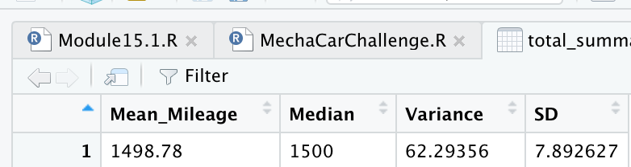
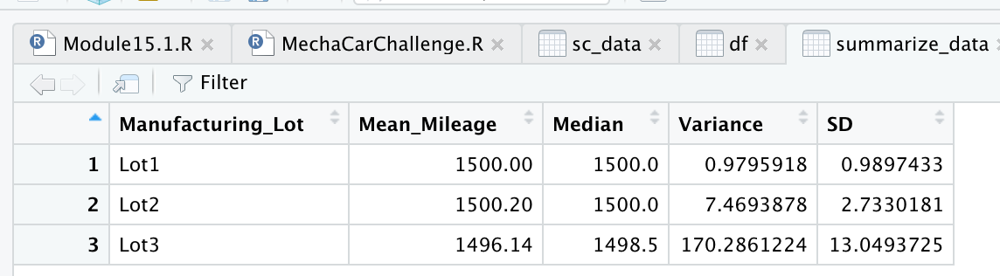

# MechaCar_Statistical_Analysis-

## Linear Regression to Predict MPG
### Linear Model 

According to our results, vehicle length, ground clearance and the intercept are statistically unlikely to provide random amounts of variance to the linear model. Length and ground clearance have a significant impact on mpg. 

Since the intercept is also significant we could look into additional variables that need to be included to avoid predicting on an  overfitted model 

r Squared value is at 0.72 and  P-value is less than 0.05 which means there is a significant relationship. 

### Questions 
1. Which variables/coefficients provided a non-random amount of variance to the mpg values in the dataset?
vehicle length, ground clearance and Intercept

2. Is the slope of the linear model considered to be zero? Why or why not?
No, P value is less than 0.05 and null hypothesis is rejected. There is significant relationship and Slope is different than 0. 

3.Does this linear model predict mpg of MechaCar prototypes effectively? Why or why not?
R Squared value is 0.72 so in theory this model could be used, but 
There is a risk of data being overfitted so would want to dig deeper or account for other variable in the multiple regression model. 

##Visualizations for the Trip Analysis

### Total Summary

### Lot Summary

### Question: 
The design specifications for the MechaCar suspension coils dictate that the variance of the suspension coils must not exceed 100 pounds per square inch. Does the current manufacturing data meet this design specification for all manufacturing lots in total and each lot individually? Why or why not?

The current manufacturing data shows an issue with Lot 3 where we have a variance of 170, exceeding the specification. Wile the total variance is 62, since this data is coming from 3 vendor lots, using total variance will be misleading  causing issues down the road. 

## T- Test 
### All Lots
 P value > 0.05 No statistical difference between mean of samples and population 

### Each Lot 
- Lot 1: P=1 > 0.05 No statistical difference between mean of Lot 1 and population 
- Lot 2: P=0.06 > 0.05 No statistical difference between mean of Lot 1 and population 
- Lot 3: p=0.042 < 0.05 Reject null and There is statistical difference between mean of Lot 3 and population. 

## Study Design: MechaCar vs Competition.

To compare MechaCar vs conmpetitors we will collect data on following metrics: 
Fuel efficiency (mpg) and maintenance Cost 

For Fuel Efficiency I would use a one sided t-test . Assuming  I will be able to access enough data . 

H0= mpg  of mechacar  is < or equal to competitor
Ha = mpg of mechanCar is >  than  mpg mean of competitors 

For Maintenance Cost I am assuming less data available and would a Z-Score .

Data needed is fuel efficiency data for competitors and Mechanical and Annual Maintenance Cost per vehicle for both Mecha and Competitors 

