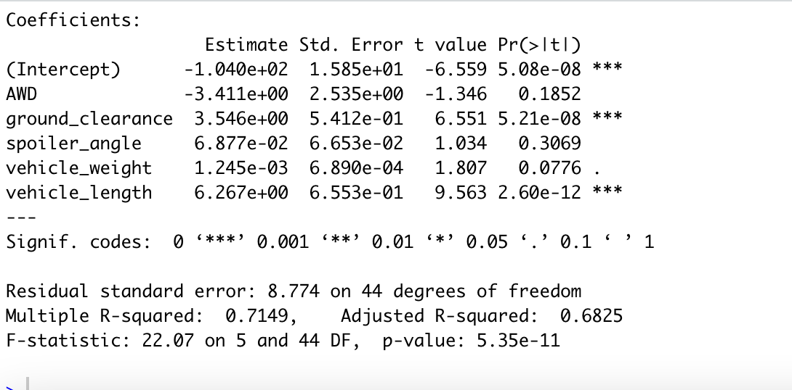

# MechaCar_Statistical_Analysis-

## Linear Regression to Predict MPG

According to our results, vehicle length, ground clearance and the intercept are statistically unlikely to provide random amounts of variance to the linear model. Length and ground clearance have a significant impact on mpg. 

Since the intercept is also significant we could look into additional variables that need to be included to avoid predicting on an  overfitted model 

r Squared value is at 0.72 and  P-value is significant

